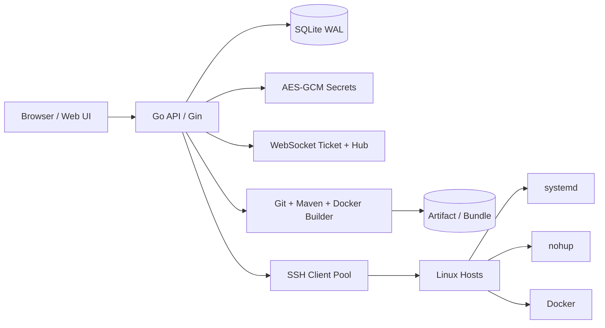

# swift-devops

> 面向 Java / Spring Boot 服务的轻量级自动化运维平台。
> 单个 Go 二进制内嵌 React 前端，用 Web 操作完成主机纳管、源码构建、制品治理、部署、回滚与运行状态检查。

## 30 秒看懂

| 问题 | swift-devops 的回答 |
|---|---|
| 适合谁 | 需要把 Java / Spring Boot 服务从 Git 构建并发布到自有 Linux 主机的小团队 |
| 解决什么 | 减少手工 SSH、手工传 jar、手工重启、手工查日志和手工回滚 |
| 怎么交付 | 一个内嵌前端的 Go 二进制，后端 API、Web UI、SQLite 数据库和制品目录都在一台控制机上运行 |
| 部署到哪里 | 通过 SSH 发布到 Linux 主机，运行时可选 `systemd`、`nohup` 或 `docker` |
| 不是什么 | 不是 Kubernetes 平台，不负责 Service Mesh / HPA / 云资源编排 |

## 架构概览



## 核心能力

- **主机纳管**：通过 SSH 管理 Linux 主机，支持密码 / 私钥认证、连通性检测、TOFU host key 记录与 Docker 容器/日志查询。
- **应用与服务建模**：一个应用可挂多个 `AppService`，每个服务独立配置端口、健康检查、JVM 参数、环境变量、启动顺序和部署模式。
- **Git 源码构建**：从远端 Git 拉取指定 branch / tag / commit，本机 Maven 构建，支持 multi-module 项目的 `mvn -pl ... -am` 与 jar pattern 提取。
- **构建模式**：支持 `local-jar`、`local-docker`、`remote-docker` 三种应用级构建模式，覆盖传统 jar 发布、本机镜像构建推送、目标机 Docker 构建运行。
- **部署运行时**：支持 `systemd`、`nohup`、`docker` 三种运行方式；切换运行时会 best-effort 清理旧模式残留。
- **发布策略**：支持 `single` 单批发布、`rolling` 分批发布，以及基于成功历史的 `rollback` 回滚流水线。
- **制品治理**：构建成功后生成 Artifact / Bundle，按 `max_history` 滚动清理历史版本，并跳过仍被部署或回滚链引用的制品。
- **实时反馈**：构建日志和部署步骤通过 WebSocket 推送，WebSocket 使用一次性 ticket 鉴权。
- **安全基础**：JWT 登录、登录限流、操作审计、SSH/Git 凭证 AES-256-GCM 加密、错误码统一返回。

## 技术栈

| 层 | 选型 |
|---|---|
| 后端 | Go 1.23 · Gin · GORM · SQLite/WAL（`glebarez/sqlite` 纯 Go）· WebSocket |
| 前端 | React 18 · TypeScript · Ant Design 5 · Vite · Zustand |
| 构建 | Git · Maven · pnpm/npm · 可选 Docker |
| 部署 | 单二进制静态编译 · Linux systemd |

## 能力矩阵

| 模块 | 能力 | 说明 |
|---|---|---|
| 主机 | SSH 纳管、连通性检测、Docker 容器/日志查询 | 支持密码和私钥；记录 host key，降低误连风险 |
| 凭证 | Git HTTPS Token / SSH Key 加密保存 | 使用 `master_key` 加密，配置丢失后需重录 Secret |
| 应用 | 应用 + 多 `AppService` 模型 | 适配单服务和 multi-module Spring Boot 项目 |
| 构建 | Git clone、Maven package、jar 提取 | 构建环境由 UI 配置 Java / Maven / Git 路径 |
| Docker | `local-docker` / `remote-docker` | 可本机构建镜像推送，也可部署时在目标机 build/run |
| 制品 | Artifact / Bundle / 历史清理 | Bundle 用来保证多服务同一次构建版本一致 |
| 部署 | `single` / `rolling` / `rollback` | rolling 支持批大小；rollback 基于成功历史新建流水线 |
| 运行时 | `systemd` / `nohup` / `docker` | 按应用或服务选择，切换时清理旧 runtime 残留 |
| 反馈 | 构建日志、部署步骤、运行日志 | 构建和部署走 WebSocket 实时推送 |
| 审计 | JWT、登录限流、操作审计 | 适合内网控制台的基础安全闭环 |

## 功能入口

登录后主要页面：

- **总览**：应用、主机、部署、构建与环境概况。
- **应用**：维护应用信息、Git 地址、构建 Ref、服务列表、运行配置、构建、部署与回滚。
- **主机资源**：纳管 SSH 主机、测试连通性、查看运行实例和 Docker 状态。
- **Git 凭证**：维护 HTTPS Token / SSH Key，Secret 入库前会加密。
- **系统设置 / 构建环境**：配置 `JAVA_HOME`、`MAVEN_HOME`、Git 可执行路径、Maven 本地仓库，并可在线检测。

## 快速开始

### 环境要求

- Go 1.23+
- Node.js 18+
- pnpm 11.3.0（没有 pnpm 时 Makefile 会回退 npm）
- 本机需要 `git`、`mvn`、`java` 才能执行源码构建
- Docker 为可选能力，仅 `local-docker` / `remote-docker` / 容器运行时需要

### 本地运行

先构建一次二进制，用它生成本地配置；不要直接把 `deploy/config.yaml.example` 当运行配置使用，它里面有占位密钥。

```bash
# 1. 构建前端并编译后端二进制
make build

# 2. 生成本地配置和初始 admin 密码
./dist/swift-devops init-config \
  --config data/config.dev.yaml \
  --data-dir data \
  --log-dir logs \
  --port 8088

# 3. 启动服务
./dist/swift-devops serve --config data/config.dev.yaml
```

启动后访问：

```text
http://127.0.0.1:8088
```

`init-config` 会输出初始密码，并写入配置同目录下的 `initial-admin-password.txt`。

### 前后端分离开发

```bash
# 终端 1：后端
./dist/swift-devops serve --config data/config.dev.yaml

# 终端 2：前端 dev server，5173 反代后端 8088
cd web
pnpm install
pnpm dev
```

访问：

```text
http://127.0.0.1:5173
```

## 构建与发布

```bash
make web             # 构建前端，产物在 web/dist
make go-build        # 编译 Linux amd64 后端二进制，要求 web/dist/index.html 已存在
make build           # web + go-build
make release         # Linux amd64 tar.gz + install.sh
make release-arm64   # Linux arm64 tar.gz + install.sh
make fmt             # gofmt
make vet             # go vet ./...
make tidy            # go mod tidy
make clean           # 清理 dist、web/dist、web/node_modules 等构建产物
```

构建产物默认不进入 Git：

```text
dist/
web/dist/*
```

项目保留 `web/dist/index.html` 作为 Go embed 的占位文件；真实前端构建时会生成完整 `web/dist`。

## Linux 生产部署

`deploy/install.sh` 适用于 Linux + systemd，需要 root 权限。发布版可以直接从 GitHub Release 拉取安装脚本：

```bash
curl -fsSL https://github.com/SolarPetal/swift_devops/releases/latest/download/install.sh | sudo bash
```

常见参数：

```bash
# 指定端口
curl -fsSL https://github.com/SolarPetal/swift_devops/releases/latest/download/install.sh | sudo bash -s -- --port 9090

# 指定版本
curl -fsSL https://github.com/SolarPetal/swift_devops/releases/download/v1.0.0/install.sh | sudo bash -s -- --version v1.0.0

# 升级，保留配置和数据
curl -fsSL https://github.com/SolarPetal/swift_devops/releases/latest/download/install.sh | sudo bash -s -- --upgrade

# 使用本地 release 包
sudo bash deploy/install.sh --local ./swift-devops-linux-amd64-v1.0.0.tar.gz
```

安装脚本会完成：

1. 创建 `swiftops` 系统用户。
2. 安装二进制到 `/opt/swift-devops/`。
3. 创建数据、制品、构建工作区和日志目录。
4. 生成 `master_key`、`jwt_secret` 和 admin 初始密码。
5. 注册并启动 systemd 服务。

默认路径：

| 路径 | 用途 |
|---|---|
| `/opt/swift-devops/` | 程序目录 |
| `/etc/swift-devops/config.yaml` | 配置文件 |
| `/var/lib/swift-devops/` | SQLite、制品、构建工作区 |
| `/var/log/swift-devops/` | stdout / stderr 日志 |
| `/root/.swift-devops-initial-password` | 初始管理员密码 |

常用运维命令：

```bash
systemctl status swift-devops
systemctl restart swift-devops
journalctl -u swift-devops -f
```

卸载：

```bash
sudo bash deploy/uninstall.sh         # 保留数据 / 配置 / 日志
sudo bash deploy/uninstall.sh --purge # 同时删除数据 / 配置 / 日志
```

## CLI 命令

```bash
swift-devops serve --config <path>         # 启动 HTTP 服务
swift-devops init-config --config <path>   # 生成初始 config.yaml
swift-devops cleanup-apps --config <path>  # 清空应用链数据，保留主机/凭证/用户/构建环境/审计
swift-devops hash-pwd <password>           # 生成 admin 密码 bcrypt 哈希
swift-devops version                       # 打印版本
```

## 配置说明

配置文件使用 YAML。最小生产配置可以通过 `init-config` 或安装脚本生成，`deploy/config.yaml.example` 只作为字段示例。

关键字段：

```yaml
server:
  port: 8088
  mode: release

database:
  driver: sqlite
  dsn: ./data/swift-devops.db

security:
  master_key: "<base64 32B>"   # 加密 SSH/Git Secret，丢失后历史密文无法解密
  jwt_secret: "<base64 32B>"
  jwt_ttl: 24h

admin:
  username: admin
  password_bcrypt: "<bcrypt hash>"

storage:
  artifact_dir: ./data/artifacts
  build_workspace: ./data/build
  max_history: 30
  max_upload_mb: 256

builder:
  docker_enabled: false         # legacy 兼容字段；Maven 容器构建镜像功能已下线，当前不生效

ssh:
  pool_size_per_host: 2
  idle_timeout: 5m
  connect_timeout: 10s

log:
  level: info
  dir: ./logs
```

> `master_key` 是加密 SSH 主机凭证和 Git Secret 的主密钥，请务必备份。丢失后只能重录相关凭证。

构建环境不再通过 `config.yaml` 配 Maven 本地仓库，登录后到 **系统设置 / 构建环境** 配置：

- `JAVA_HOME`
- `MAVEN_HOME`
- Git 可执行路径（可选）
- Maven 本地仓库（可选）

## 典型使用流程

1. 在 **系统设置 / 构建环境** 配好 Java、Maven、Git 并点击检测。
2. 在 **Git 凭证** 中添加私有仓库需要的 Token 或 SSH Key。
3. 在 **主机资源** 中添加目标主机并测试 SSH 连通性。
4. 在 **应用** 中创建应用，填写 Git 仓库、默认 Ref、部署路径和运行/构建模式。
5. 在应用详情中扫描或手动维护 `AppService`，配置各服务端口、模块、jar pattern、Dockerfile 模板等。
6. 触发构建，查看实时日志，成功后得到 Artifact / Bundle。
7. 绑定目标主机，选择 `single` 或 `rolling` 发布策略执行部署。
8. 需要恢复时，选择成功历史触发 `rollback`。

## 目录结构

```text
cmd/swift-devops/          CLI 与 HTTP 服务入口
internal/api/              Gin 路由、handler、middleware、WebSocket 入口
internal/config/           YAML 配置加载与默认值
internal/model/            GORM 数据模型
internal/service/          主机、应用、服务、构建、制品、部署流水线业务编排
internal/pkg/builder/      Git clone、Maven 构建、jar 提取、Docker image 构建
internal/pkg/deploy/       systemd / nohup / docker runtime 抽象与远端部署
internal/pkg/ssh/          SSH 客户端、连接池、host key、连通性检测
internal/pkg/ws/           WebSocket hub 与一次性 ticket
internal/store/            SQLite 打开与 AutoMigrate
web/                       React 前端与 embed 静态资源
deploy/                    Linux 安装、卸载脚本与配置样例
```

## 开发校验

```bash
go test ./...
make vet
cd web && pnpm build
```

有 Docker 环境时，部分集成测试会覆盖远端部署模拟；没有 Docker 时相关测试会跳过。
